# Creating a Security Information and Event Manager (SIEM)

We are going to create our SIEM with Microsoft Azure

#Step 1 Creating our VM 

First, we want to create our Windows 10 pro Virtual Machine and name our resource group. (Naming a group now will create one automatically.) 
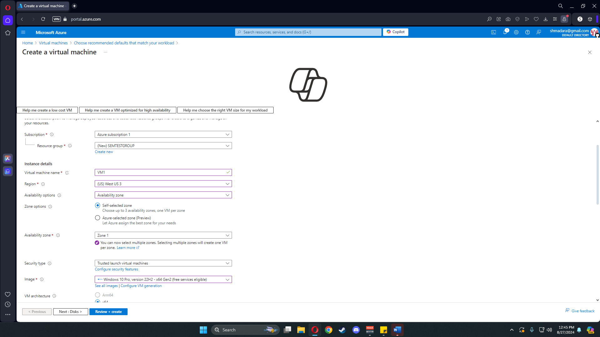

The most important part of our simulation is allowing all RDP ports. We are using a default username and random password for our credentials. 

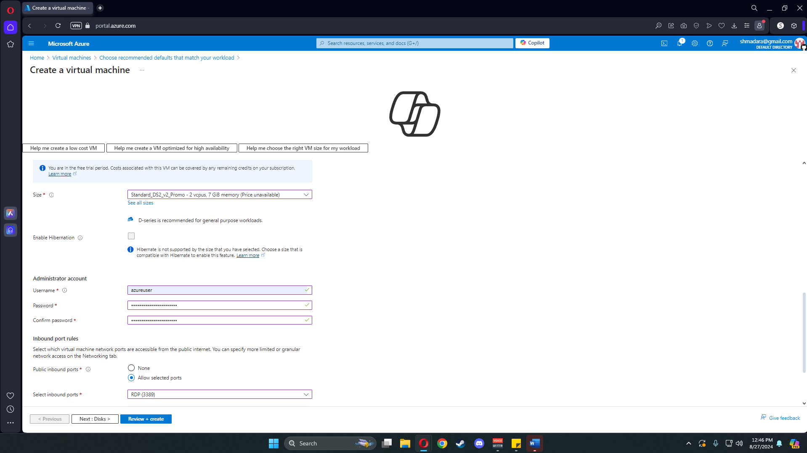

Now, we just click through to allow Azure to create the default settings until we reach our networking page. Here, we ensure that we enable port 3389.  

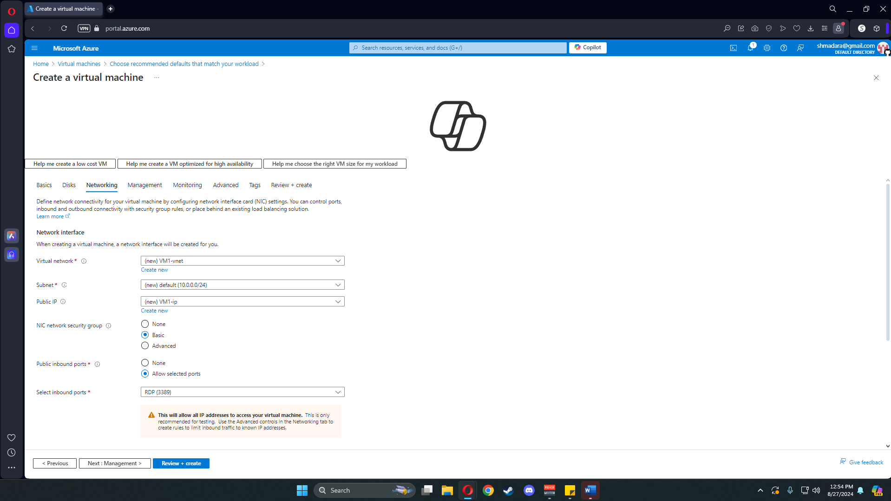

This is what our final review page should look like.

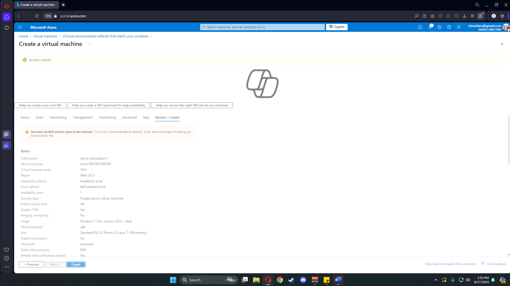

#Step 2 Setting up Microsoft Sentinel

In our search bar, we type in Mircosoft Sentinel and create our workspace. We click our resource group and name our Log Analytics workspace.

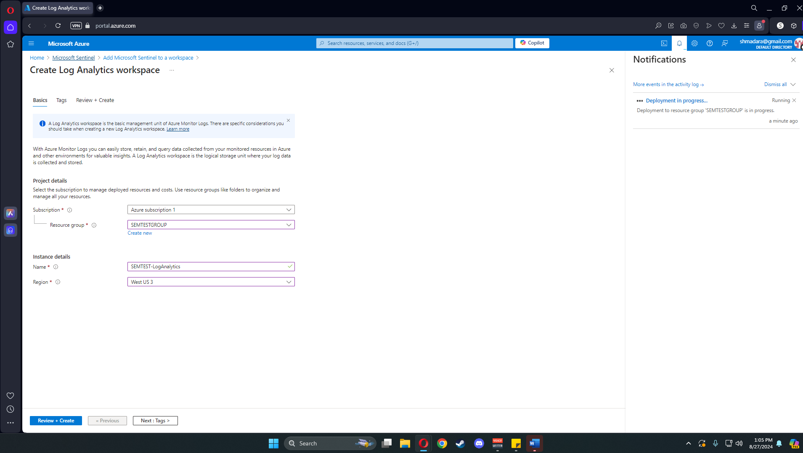

After creating the Log analytics, we click add to connect it in our workplace.

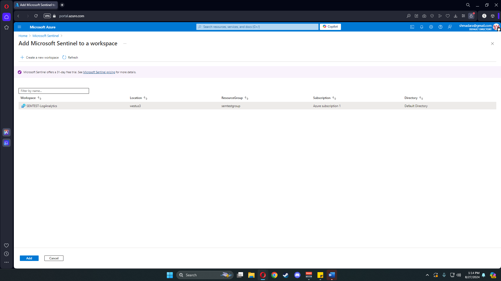

Now, we need a way to send our VM's data to Microsoft Sentinel. We accomplish this goal with a data connector. We can set one up by navigating our Sentinel page. 

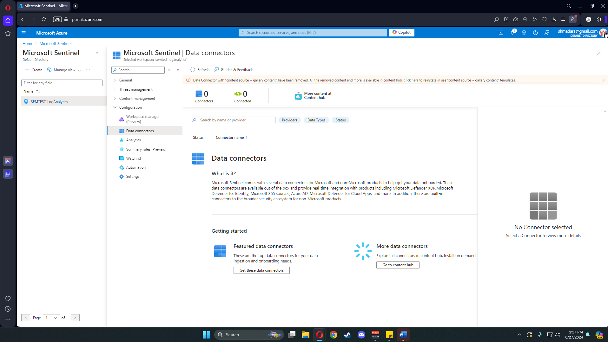

There are many connector options; for my SIEM, I am using Windows Security Events. 

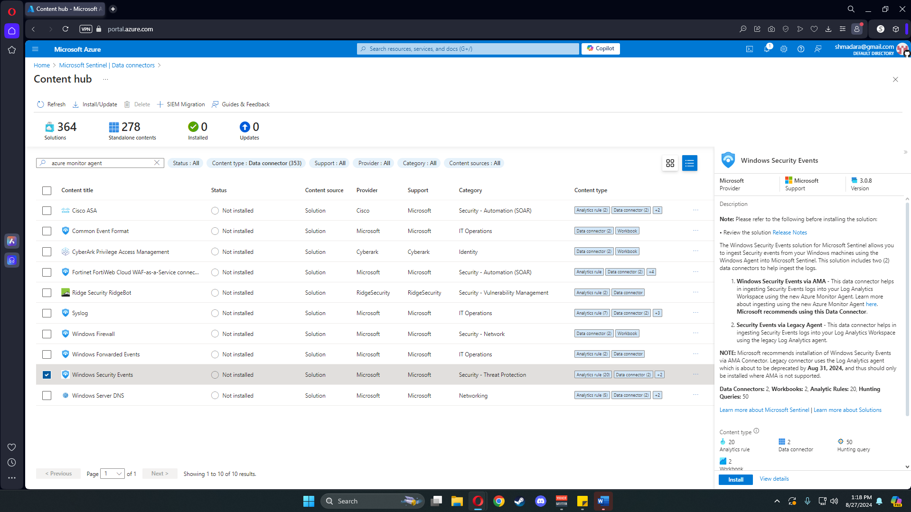

Next, we configure our data connector. On our configuration page, we have two options. The legacy option is discontinued so select Windows Security Events via AMA. 

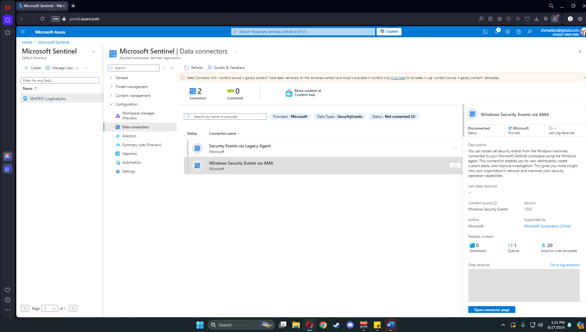

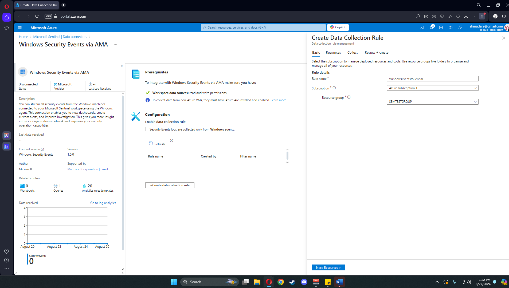

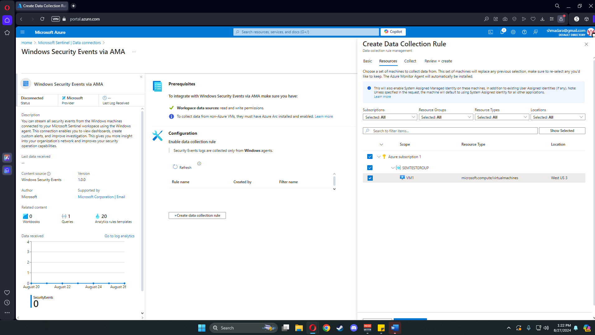


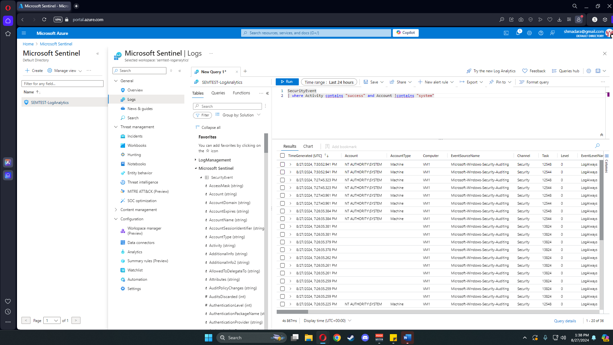

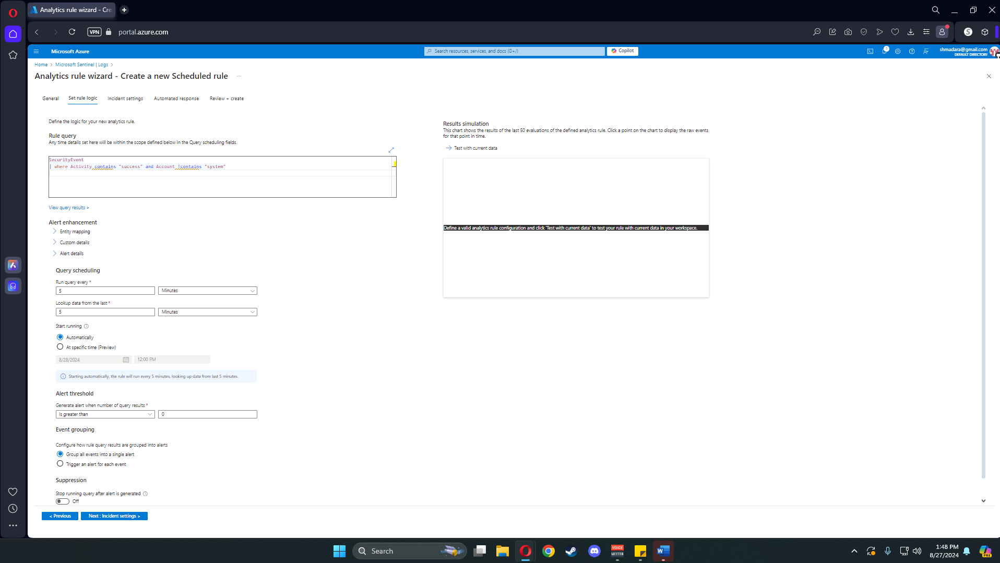

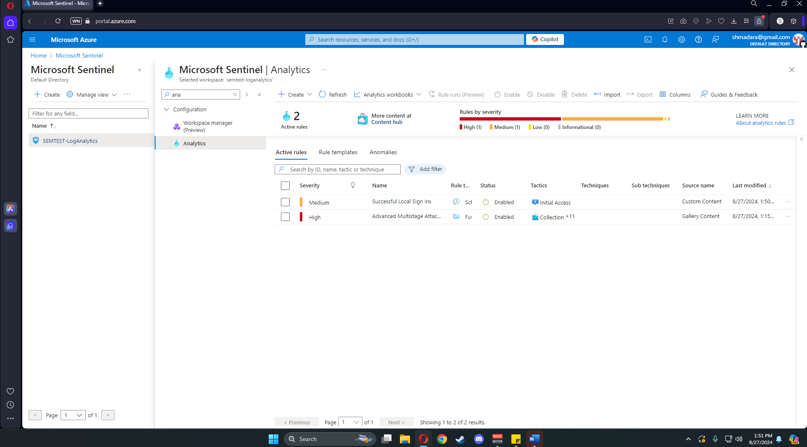

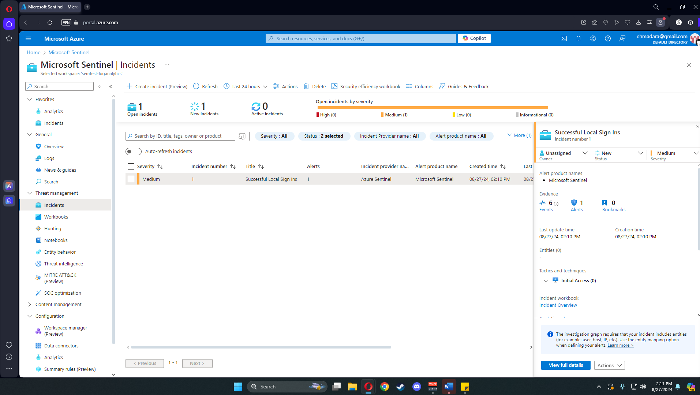

## Header 2

> This is a blockquote following a header.
>
> When something is important enough, you do it even if the odds are not in your favor.

### Header 3

```js
// Javascript code with syntax highlighting.
var fun = function lang(l) {
  dateformat.i18n = require('./lang/' + l)
  return true;
}
```

```ruby
# Ruby code with syntax highlighting
GitHubPages::Dependencies.gems.each do |gem, version|
  s.add_dependency(gem, "= #{version}")
end
```

#### Header 4

*   This is an unordered list following a header.
*   This is an unordered list following a header.
*   This is an unordered list following a header.

##### Header 5

1.  This is an ordered list following a header.
2.  This is an ordered list following a header.
3.  This is an ordered list following a header.

###### Header 6

| head1        | head two          | three |
|:-------------|:------------------|:------|
| ok           | good swedish fish | nice  |
| out of stock | good and plenty   | nice  |
| ok           | good `oreos`      | hmm   |
| ok           | good `zoute` drop | yumm  |

### There's a horizontal rule below this.

* * *

### Here is an unordered list:

*   Item foo
*   Item bar
*   Item baz
*   Item zip

### And an ordered list:

1.  Item one
1.  Item two
1.  Item three
1.  Item four

### And a nested list:

- level 1 item
  - level 2 item
  - level 2 item
    - level 3 item
    - level 3 item
- level 1 item
  - level 2 item
  - level 2 item
  - level 2 item
- level 1 item
  - level 2 item
  - level 2 item
- level 1 item

### Small image


### Large image


### Definition lists can be used with HTML syntax.

<dl>
<dt>Name</dt>
<dd>Godzilla</dd>
<dt>Born</dt>
<dd>1952</dd>
<dt>Birthplace</dt>
<dd>Japan</dd>
<dt>Color</dt>
<dd>Green</dd>
</dl>

```
Long, single-line code blocks should not wrap. They should horizontally scroll if they are too long. This line should be long enough to demonstrate this.
```

```
The final element.
```
