# About Me

I am a cybersecurity student at Full Sail University working toward a career as a SOC Analyst. I enjoy hands-on projects, threat detection, and building practical security skills outside of coursework.

**Email:** seancardona2@gmail.com &nbsp;|&nbsp; **GitHub:** [github.com/seandon8888](https://github.com/seandon8888)

---

# Skills

<ul class="skills">
  <li>Microsoft Azure</li>
  <li>Microsoft Sentinel (SIEM)</li>
  <li>Log Analytics</li>
  <li>Firewall Configuration</li>
  <li>Incident Response</li>
  <li>Windows Security Events</li>
  <li>RDP / Remote Access</li>
  <li>CompTIA Security+</li>
</ul>

---

# Certifications

<iframe src="CompTIA Security+ ce certificate.pdf" width="100%" height="600px"></iframe>

---

# Project 1: Building a SIEM with Microsoft Azure

In this project I built a Security Information and Event Management (SIEM) system using Microsoft Azure and Microsoft Sentinel to detect and respond to real-time security events.

## Step 1: Creating the Virtual Machine

First, create a Windows 10 Pro Virtual Machine and name the resource group. (Naming a group now creates one automatically.)

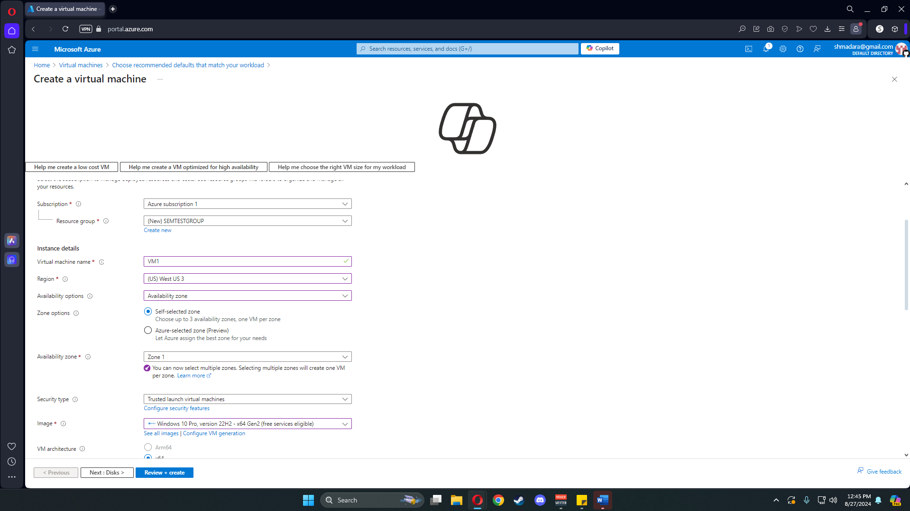

The most important part of the simulation is allowing all RDP ports. A default username and random password are used for credentials.

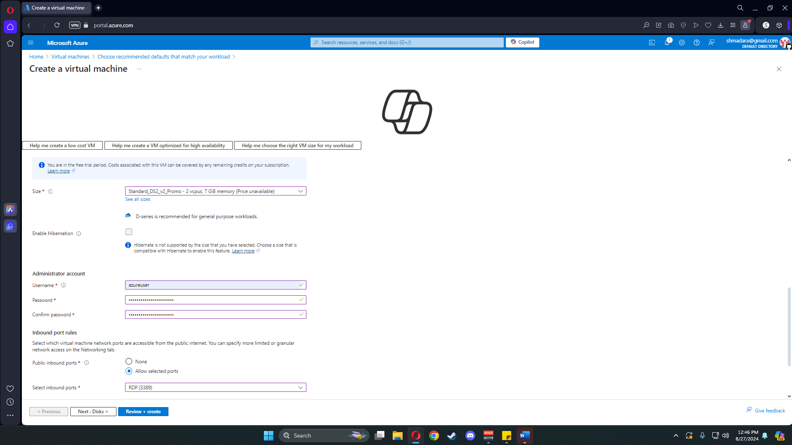

Click through the default Azure settings until reaching the networking page, then ensure port 3389 is enabled.

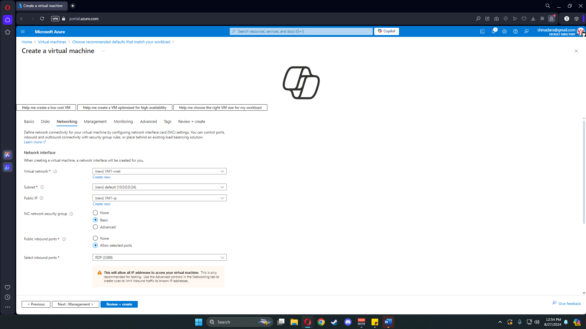

This is what the final review page should look like before deploying.

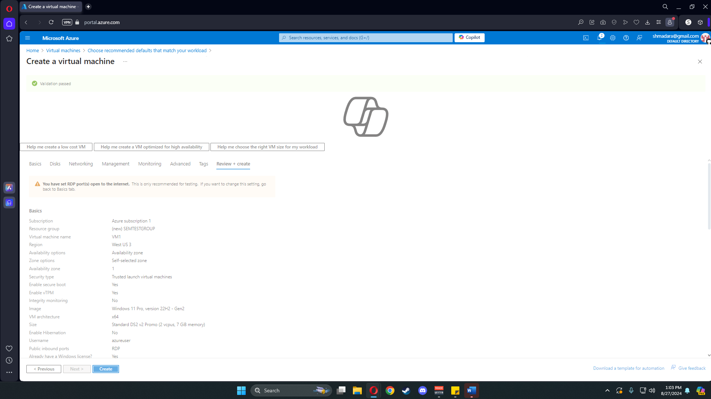

## Step 2: Setting Up Microsoft Sentinel

Search for Microsoft Sentinel and create a workspace. Select the resource group and name the Log Analytics workspace.

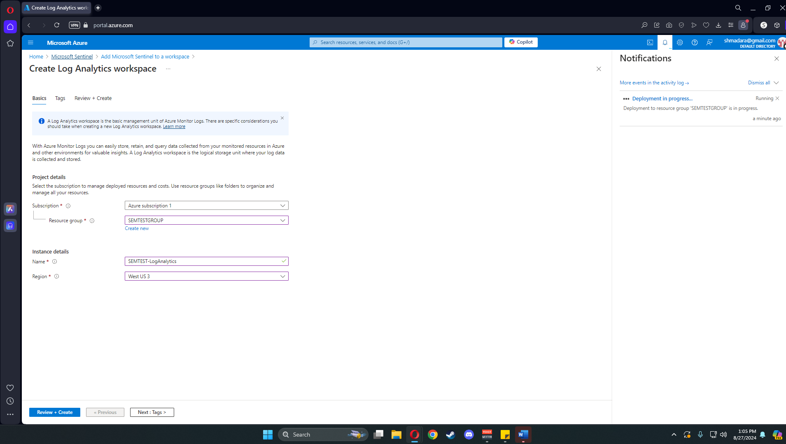

After creating the Log Analytics workspace, click **Add** to connect it.

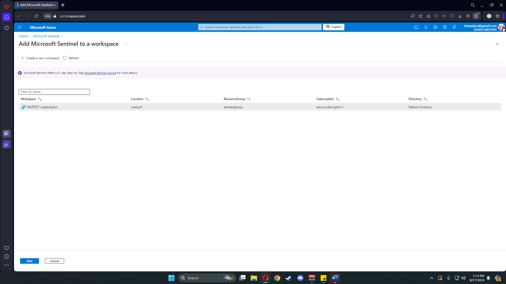

To send VM data to Microsoft Sentinel, configure a data connector from the Sentinel page.

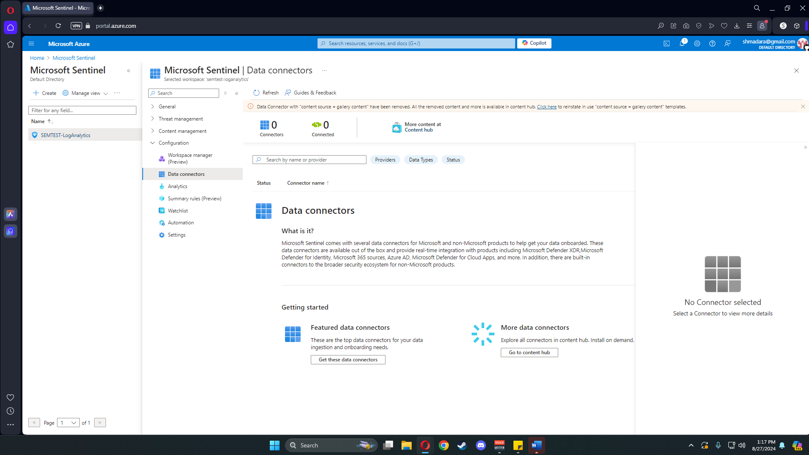

There are many connector options. For this SIEM, Windows Security Events is selected.

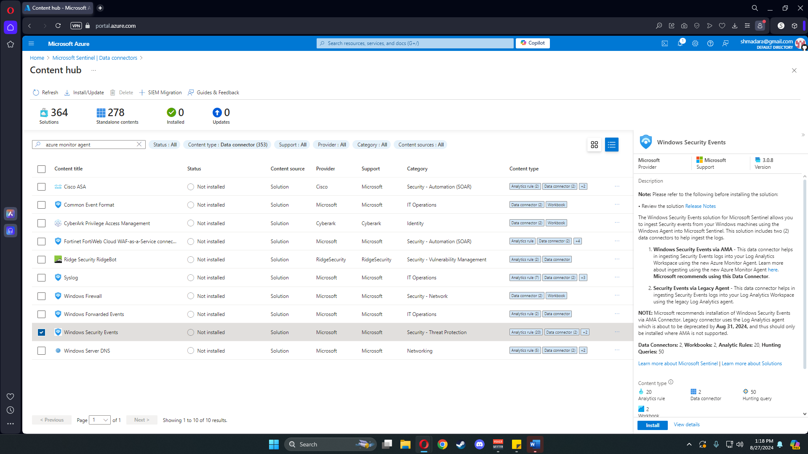

On the configuration page there are two options — the legacy option is discontinued, so select **Windows Security Events via AMA**.

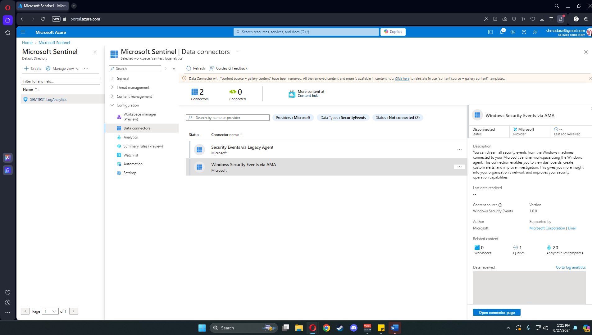

With the connector configured, create a collection rule to filter incoming data.

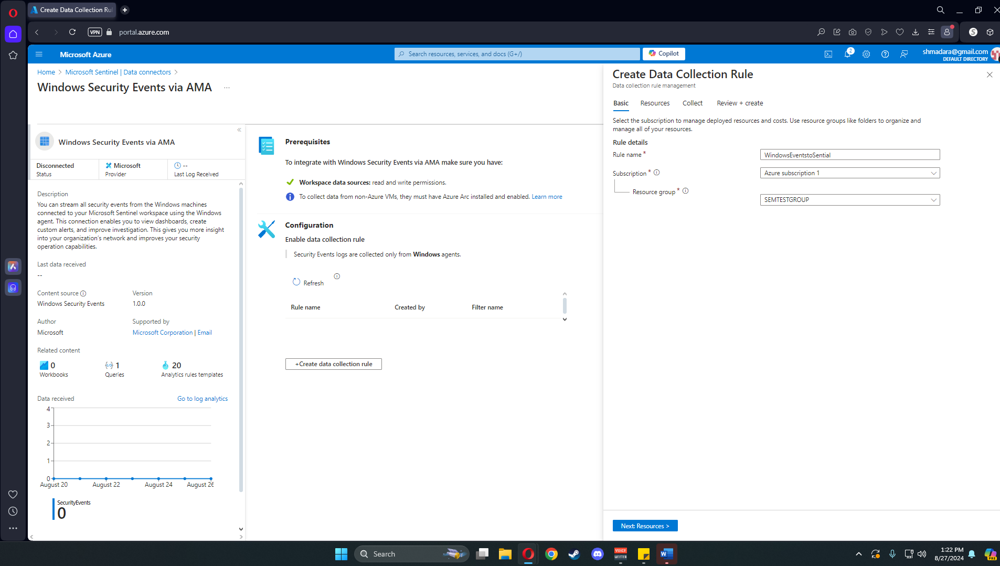

Select the VM and resource group, then the rule is created.

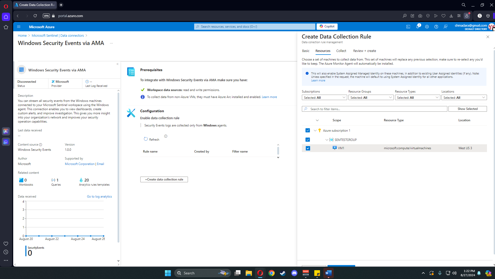

The rule can be accessed to see all data flowing into Log Analytics.

In the query editor, write a query to filter for successful RDP connections only.

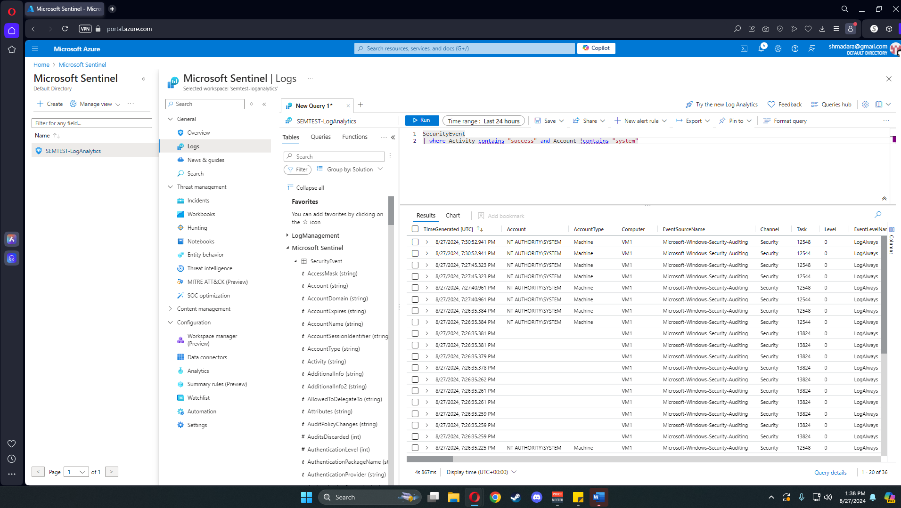

Name the rule **Successful Local Sign-Ins** and configure the alert settings.

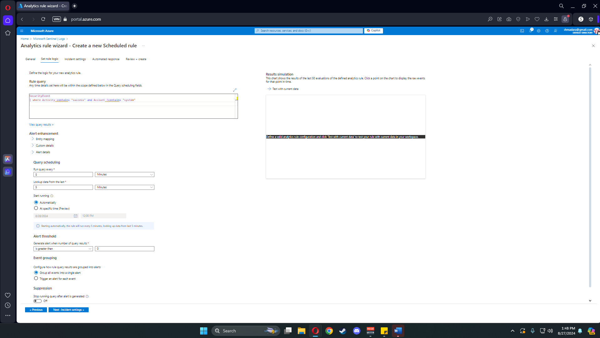

The overview page shows the new rule alongside a default Azure rule.

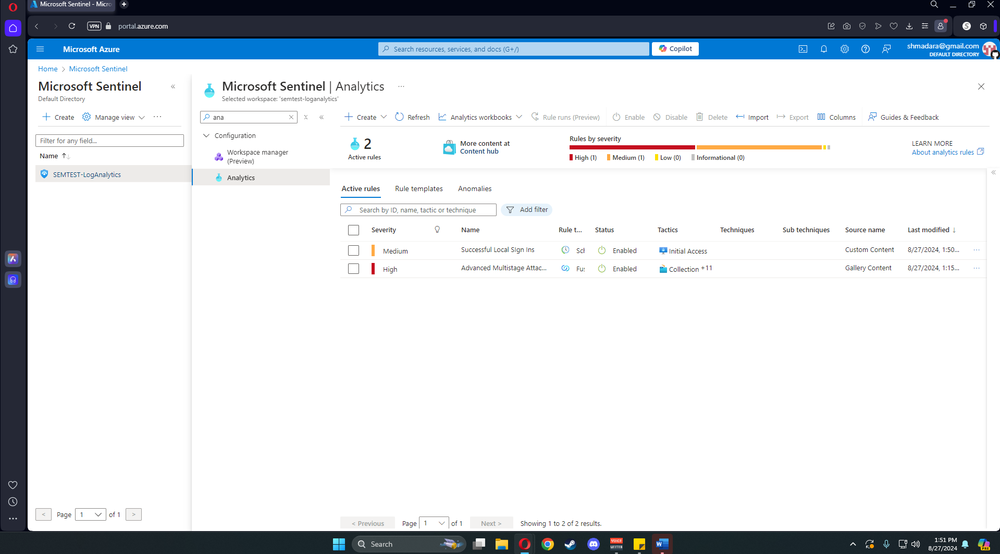

Finally, RDP into the VM from another device. The login triggers the rule and generates an incident notification.

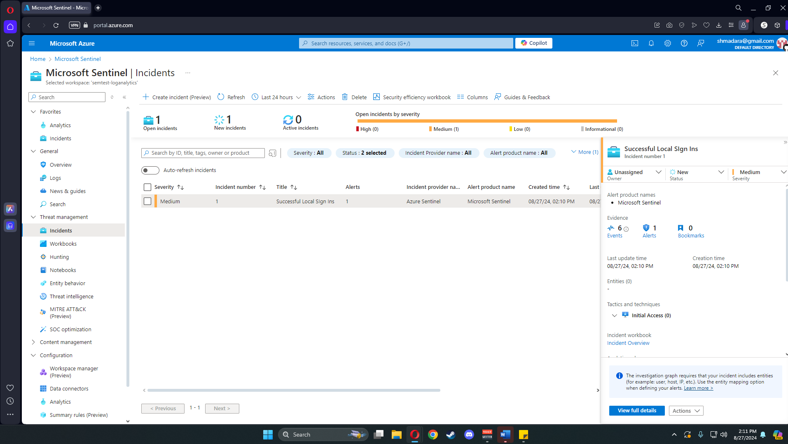

---

# Project 2: Creating and Configuring a Firewall

<iframe width="100%" height="500"
src="https://www.youtube.com/embed/Ryd_l0Yk22A?si=f_9hkh_n3rtSF6hz">
</iframe>

---

# School Project IV: Password Standard

<iframe src="Project IV password standard.pdf" width="100%" height="600px"></iframe>
